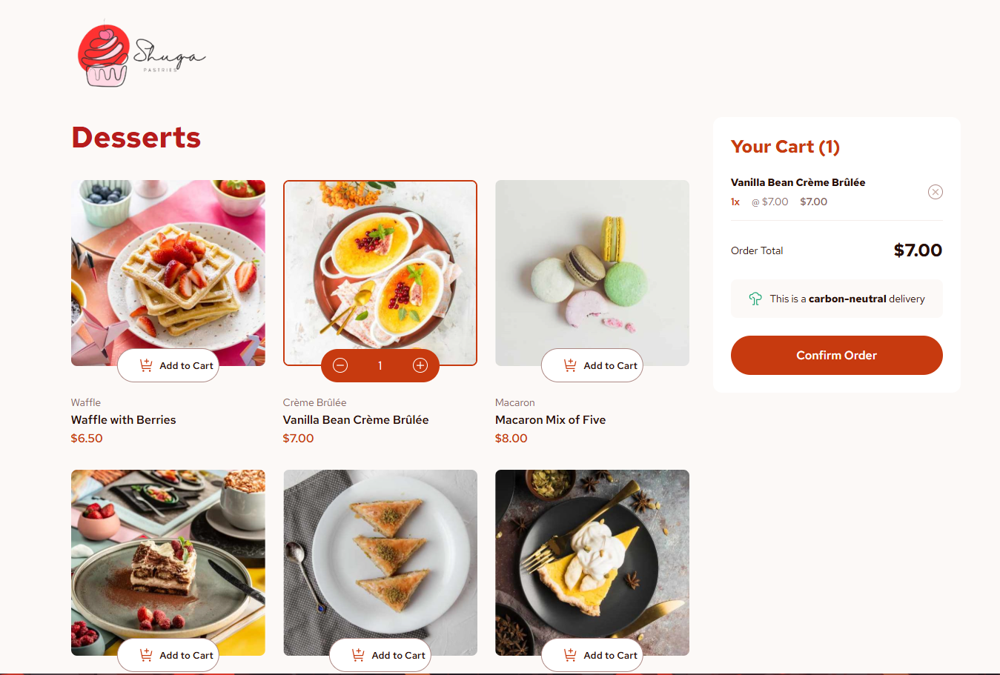

  

# 🍰 Shuga Pastries – Dessert Ordering UI

A modern, responsive dessert ordering interface built with clean layout principles and a focus on intuitive cart interaction.

This project showcases a visually appealing product grid, interactive cart functionality, and a minimal, elegant UI suitable for an e-commerce pastry brand.

---

## ✨ Features

- 🧁 Product grid layout
- ➕ Add to Cart functionality
- ➖ Increment / Decrement quantity controls
- 🛒 Dynamic cart summary panel
- 💰 Real-time order total calculation
- 🌱 Carbon-neutral delivery badge UI
- 🎨 Clean, soft color palette with strong visual hierarchy
- 📱 Responsive design

---

## 🖼️ Preview

The interface includes:

- Dessert product cards (Waffle with Berries, Vanilla Bean Crème Brûlée, Macaron Mix, etc.)
- Interactive quantity selector
- Sticky cart summary panel
- Clear call-to-action button for order confirmation

---

## 🛠️ Built With

- React

&copy; 2026 Ammar.

